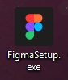
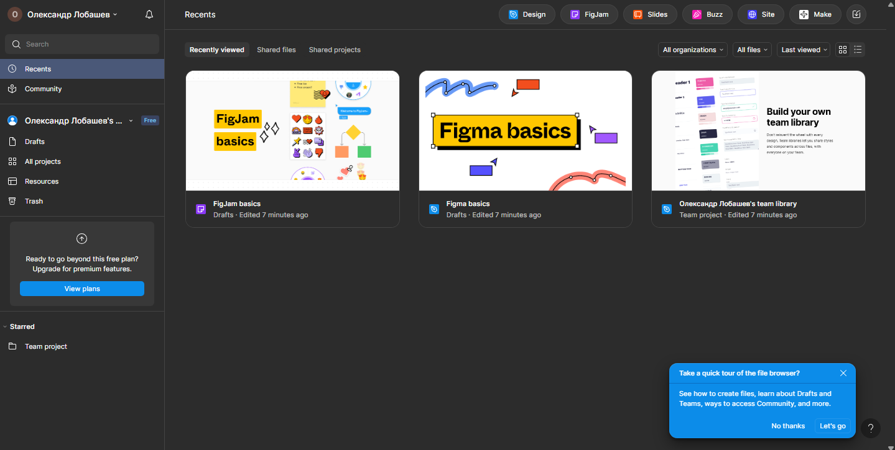

# Workshop_1

## Тема заняття
ОГЛЯД І ПОРІВНЯЛЬНА ХАРАКТЕРИСТИКА СЕРВІСІВ ДЛЯ ПРОЕКТУВАННЯ КОРИСТУВАЛЬНИЦЬКИХ ІНТЕРФЕЙСІВ

## Хід роботи

### 1. Встановлення Figma
Завантажив та встановив на свій комеп'ютер програму Figma

### 2. Відкриття додатку Figma
Запустивши програму Figma, залогінився у вже створений обліковий запис

## Висновки
На практиці я зробив:
  - зареєструвався у Figma
  - завантажив та встановив десктопну версію
  - зайшов в свій обліковий запис у додатку

Ця робота навчила мене:
  - як створити акаунт у FIgma
  - працювати з інтерфейсом додатку Figma
