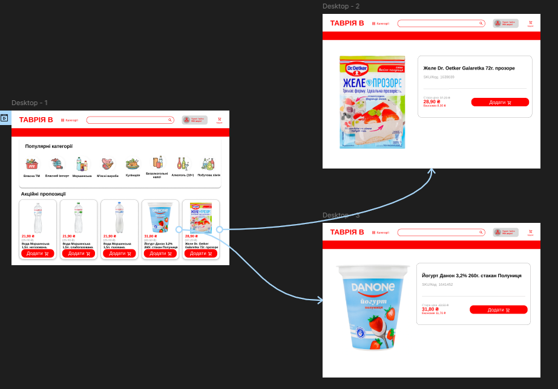
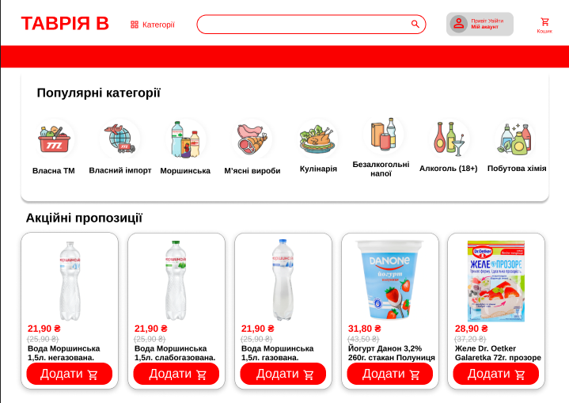
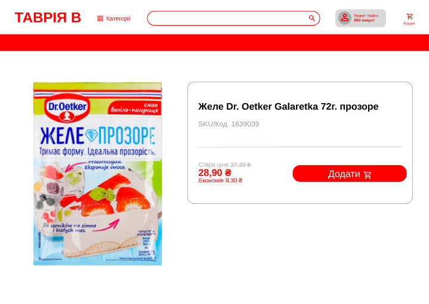
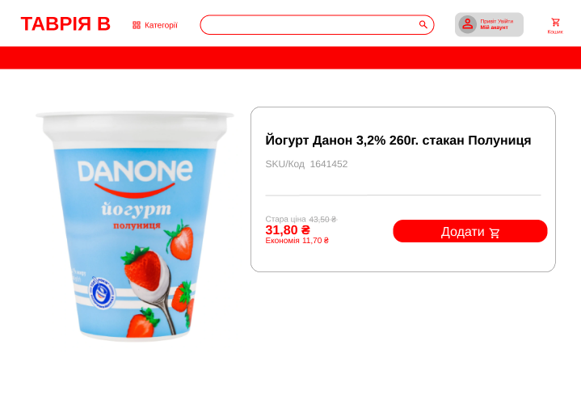

# Workshop_12

## Тема заняття
Розробка wireframe

## Хід роботи

### 1. Підготовка робочого середовища

У Figma я створив головний фрейм для wireframe головної сторінки сайту продуктового магазину, а також два додаткові фрейми для сторінок товарів: сторінки йогурта та сторінки желе.

### 2. Створення структури головної сторінки

Зробив загальний вигляд структури сайту:
- хедер з логотипом магазину, полем пошуку, кнопкою входу до особистого кабінету та кнопка до кошика
- блок популярні категорії
- блок акційні пропозиції
- блоки товарів
- зображення товарів
- назва
- ціна
- кнопки додати до кошика

### 3. Створення сторінки йогурта

На окремому фреймі створив сторінку товару йогурт. Додані:
- ціна
- код товару
- назва товару
- зображення
- кнопка "додати до кошика"
- ціна

### 4. Створення сторінки желе

На окремому фреймі створив сторінку товару йжеле. Додані:
- ціна
- код товару
- назва товару
- зображення
- кнопка "додати до кошика"
- ціна

Посилання на проект: https://www.figma.com/design/6SlwcqPwYRleOW7NdKfm3p/Untitled?node-id=0-1&t=wNcIfELTYuewIOue-1

## Висновок

У ході виконання практичної роботи було створено wireframe головної сторінки сайту продуктового магазину та сторінок окремих товарів у середовищі Figma. Було опрацьовано принципи побудови структури вебсторінок, розміщення основних елементів інтерфейсу та логіку подання інформації для користувача.

Під час роботи я навчився створювати фрейми для різних сторінок, будувати ієрархію блоків, а також використовувати сітку для впорядкування елементів і дотримання пропорцій. Використання сіток значно спростило процес вирівнювання об’єктів та зробило макет більш структурованим і зрозумілим.
