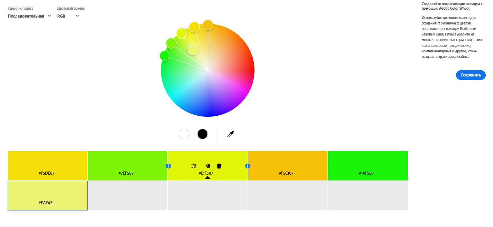
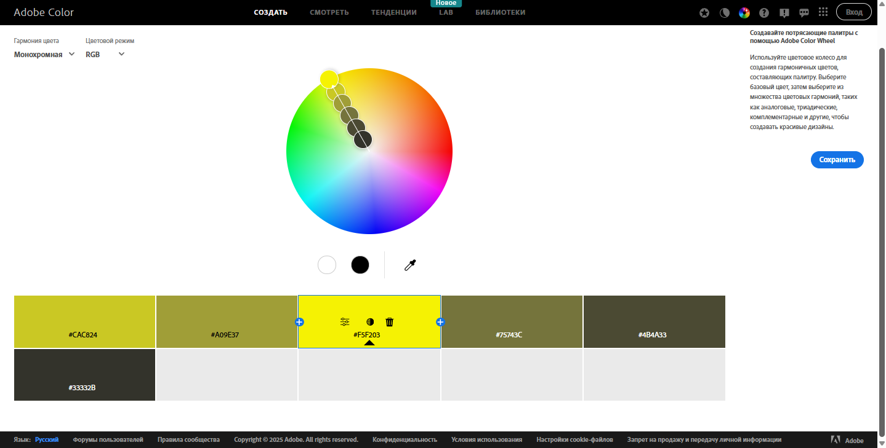
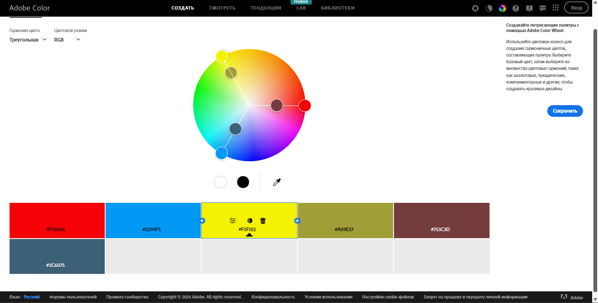
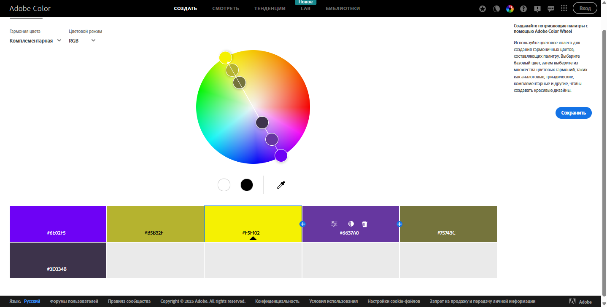
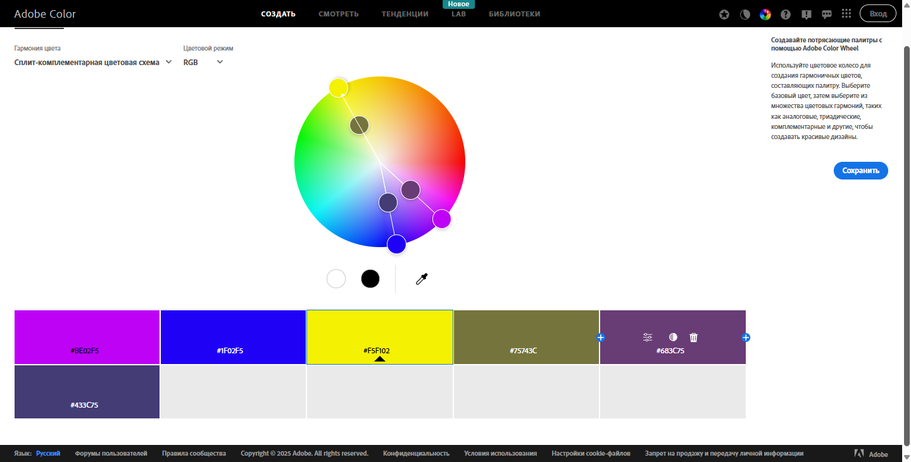
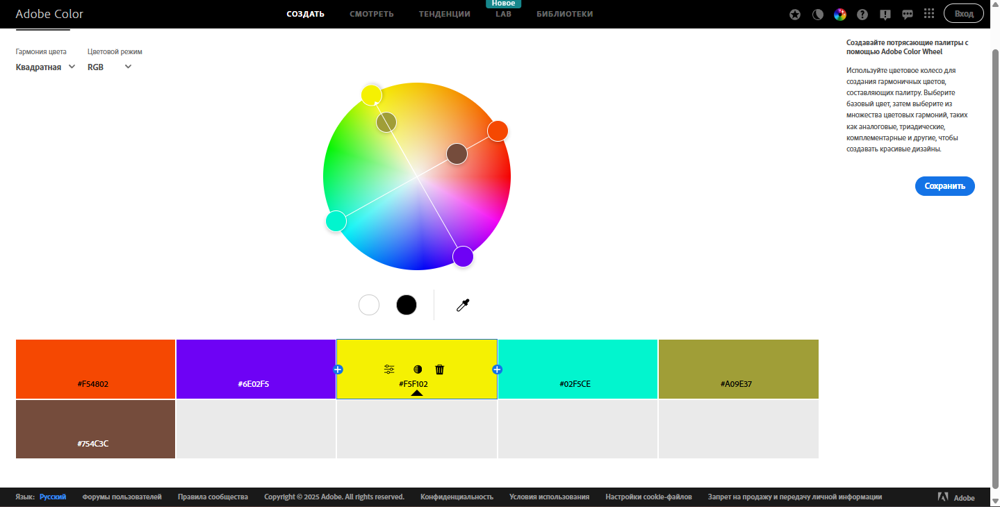
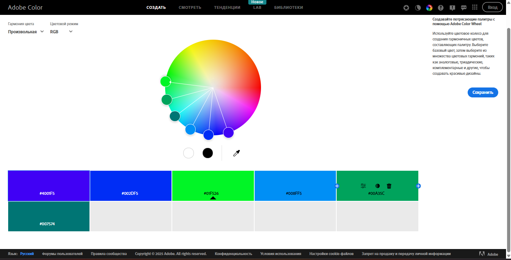

# Workshop_13

## Тема заняття
Дослідження кольорових гармоній та інструментів аналізу кольору в Adobe Color

## Мета роботи
1. Ознайомити студентів із поняттям кольорової гармонії та основними типами гармонії кольорів. 
2. Навчити студентів використовувати колірне колесо для побудови палітр за різними принципами гармонії. 
3. Ознайомити із можливостями автоматичного виділення кольорових палітр із зображень та створення градієнтів. 
4. Навчити перевіряти контрастність кольорових пар відповідно до стандартів доступності (WCAG). 
5. Закріпити навички документування та аналізу роботи з кольором у Markdown-форматі у GitHub-репозиторії.

## Теоретична частина
1. Кольорова гармонія

Кольорова гармонія — це збалансоване поєднання кольорів, яке забезпечує приємне сприйняття дизайну, покращує читабельність і допомагає виділяти важливі елементи інтерфейсу.

2. Типи кольорової гармонії
- Analogous — сусідні кольори на колірному колі, м’який та спокійний вигляд
- Monochromatic — один колір з різною яскравістю й насиченістю
- Triad — три рівновіддалені кольори, динамічна композиція
- Complementary — протилежні кольори, високий контраст
- Split Complementary — базовий і два сусідні до комплементарного
- Square — чотири рівновіддалені кольори
- Custom — палітра, створена дизайнером для конкретного проєкту

3. Колірні моделі
- RGB — модель для екранів, складається з червоного, зеленого та синього
- HSB — описує колір через відтінок, насиченість і яскравість
- LAB — модель, орієнтована на людське сприйняття, точна передача кольору

4. Контрастність і доступність

Контрастне співвідношення — різниця між кольором тексту і фону, що впливає на читабельність.
Стандарти WCAG 2.1:
- AA — 4.5:1 (звичайний текст), 3:1 (великий)
- AAA — 7:1 (звичайний), 4.5:1 (великий)

## Практична частина

### Хід роботи

1. Робота з колірним колесом   
   Тип: Analogous
   
   Базовий колір:
   Жовтий — #F1F507 (центр палітри)

   Логіка побудови:
   Палітра побудована на сусідніх відтінках колірного кола в діапазоні жовтого → жовто-зеленого → зеленого. Усі кольори мають близький тон і високу яскравість, що створює плавні переходи без різких контрастів. Така гармонія зберігає цілісність і візуальну стабільність.

   Передбачуваний емоційний ефект:
- відчуття свіжості та енергії
- асоціації з природою, весною, ростом
- позитивний, оптимістичний настрій
- добре підходить для екологічних, освітніх або lifestyle-проєктів

   Тип: Monochromatic
   
   Базовий колір: Жовтий — #F5F203

   Логіка побудови:
   Палітра створена на основі одного кольору з варіаціями його яскравості та насиченості — від світлих жовтих відтінків до темних оливково-зелених і майже чорних. Зміна відбувається не за тоном, а за світлотою, що забезпечує строгість і структурованість.

   Передбачуваний емоційний ефект:
- відчуття стабільності та серйозності
- спокійна, зібрана атмосфера
- професійність і стриманість
- добре підходить для інтерфейсів, аналітики, корпоративного дизайну

   Тип: Triad 
   
   Базовий колір: Жовтий — #F5F102

   Логіка побудови:
   Палітра базується на трьох кольорах, рівномірно розташованих на колірному колі (жовтий, синій, червоний), з додатковими приглушеними відтінками для балансу. Такий підхід створює виразний контраст, але зберігає гармонію завдяки симетрії.

   Передбачуваний емоційний ефект:
- динаміка та активність
- емоційна насиченість
- привертання уваги
- підходить для креативних, рекламних або ігрових проєктів

   Тип: Complementary
   

   Тип: Split Complementary
   

   Тип: Square 
   

   Тип: Custom
   
   
## Висновок

