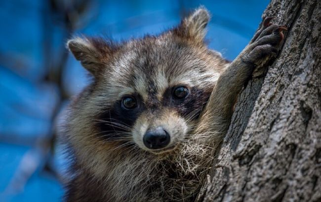
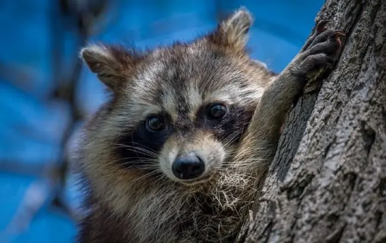
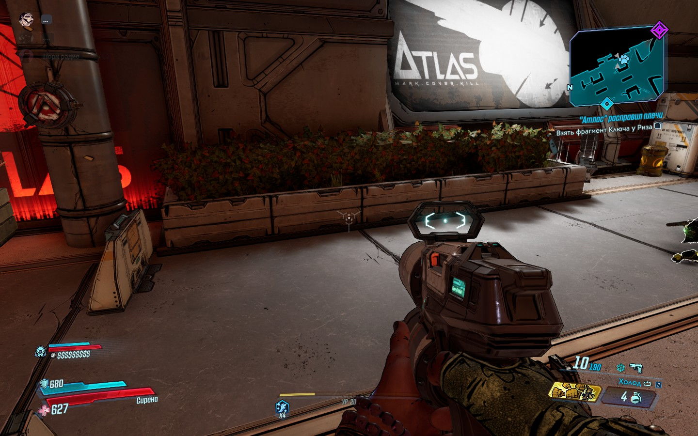

# Workshop_14

## Тема заняття
Оптимізація зображень за допомогою Squoosh

## Мета роботи
1. Ознайомити студентів із методами стиснення зображень та їхнім впливом на якість.
2. Навчити визначати оптимальний баланс між якістю та розміром файлу.
3. Ознайомити студентів із різними типами стиснення: без втрат (lossless) та з втратами (lossy).
4. Дослідити вплив зміни розміру на якість зображення та вагу файлу.
5. Навчитися адаптувати зображення для різних цільових застосувань:
  - Веб (оптимізація для швидкого завантаження).
  - Мобільні пристрої (зменшені розміри, ефективне стиснення).
  - Retina-дисплеї (2x, 3x версії для збереження якості).
6. Закріпити навички документування та аналізу результатів у Markdown-форматі у GitHub-репозиторії.

## Теоретична частина
Squoosh — вебінструмент для оптимізації зображень, який дозволяє стискати файли, змінювати формат і розмір та порівнювати якість до і після обробки без завантаження на сервер.

Типи стиснення зображень:
- Lossless — без втрати якості (PNG, WebP lossless)
- Lossy — з втратою якості (MozJPEG, WebP lossy, AVIF)

Зміна розміру зображення впливає на якість і вагу файлу: зменшення роздільної здатності скорочує розмір, але може знижувати чіткість.

Оптимізація для Retina-дисплеїв передбачає використання зображень у масштабі 2x / 3x та адаптивних зображень у вебі за допомогою атрибута srcset.

## Практична частина

### 1. Початкові зображення
Фото: Формат - jpg, вага файлу - 54,2КБ, розмір - 650х410  
Скріншот: Формат - jpg, вага файлу - 287КБ, розмір - 1440х900  
Графіка з текстом: Формат - jpg, вага файлу - 6,51КБ, розмір - 313х161

### 2. Стиснення без втрати якості (lossless)
|     Тип          | Початковий розмір | Lossless стиснення(WebP) | Lossless стиснення(PNG) |
| ---------------- | ----------------- | ------------------------ | ----------------------- |
|        Фото      |     54,2КБ        |           256КБ          |         510КБ           |
|      Скріншот    |       287КБ       |             1,08МБ       |         2,25МБ          |
|Графіка з текстом |      6,51КБ       |              17,2КБ      |         35,1КБ          |

### 3. Стиснення з втратою якості (lossy)
Фото:
| Формат | 100% | 75%   | 50%  |
| ------ | ---- | ---   | ---  |
| MozJPEG|136КБ |40КБ   |23,7КБ|
| WebP   |111КБ |36,4КБ |28КБ  |
| AVIF   |89,4КБ|43,6КБ |25КБ  |

Скріншот:
| Формат | 100% | 75%   | 50%  |
| ------ | ---- | ---   | ---  |
| MozJPEG|738КБ |132КБ  |78КБ  |
| WebP   |439КБ |109КБ  |76,5КБ|
| AVIF   |414КБ |155КБ  |62,3КБ|

Графка з текстом:
| Формат | 100% | 75%   | 50%  |
| ------ | ---- | ---   | ---  |
| MozJPEG|16,1КБ|4,97КБ |3,76КБ|
| WebP   |7,86КБ|2,57КБ |2,06КБ|
| AVIF   |8,86КБ|3,51КБ |1,79КБ|

### 4. Оптимізація розміру відповідно до цільового використання
Фото:  
| 1200 px | 600 px | Retina   |
| ------  | ------ | -------  | 
| 90,5КБ  | 32,9КБ | 225КБ    | 

Скріншот:  
| 1200 px | 600 px | Retina   |
| ------  | ------ | -------  | 
| 96,2КБ  | 29,7КБ | 283КБ    | 

Графіка з текстом:  
| 1200 px | 600 px | Retina   |
| ------  | ------ | -------  | 
| 27,6КБ  | 11,1КБ | 73,7КБ   | 

### 5. Візуальний аналіз та висновки

Фото  
Оригінал  

Webp 75%  

Скріншот  
Оригінал  

Webp 75%  

Графіка з текстом 
Оригінал  

Webp 75%  

№№№ Висновок
