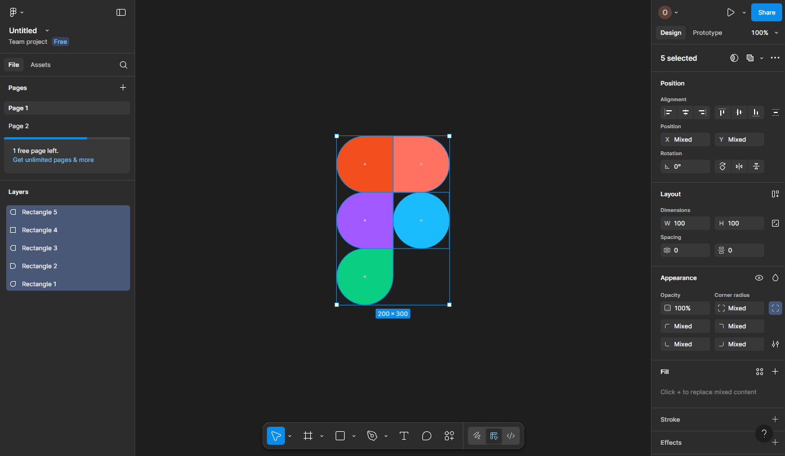

# Workshop_2

## Тема заняття
Робота з простими формами та їх властивостями у Figma.

## Хід роботи

### 1. Створення прямокутників
Відкривши застосунок Figma, створив новий проект, в ньому зробив 5 фігур типу Ractangle для логотипу  

### 2. Редагування фігур
Щоб створити логотип, я заокруглював кути кожного прямокутника, щоб надати їм відповідної форми

### 3. Надання кольору
Коли змінив форму, надав кожній фігурі відповідний колір

## Висновки
На практиці я зробив:
  - створив кілька фігур у застосунку Figma
  - заокруглив їх за допомогою зміни радіусу кутів
  - змінив колір фігур

Ця робота навчила мене:
  - як працювати з базовими елементами
  - змінювати властивості об'єктів
