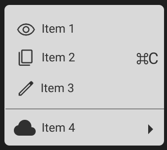

# Workshop_4

## Тема заняття
Фрейми, групи і секції у Figma

## Хід роботи

### 1. Підготовка робочого середовища
У Figma я створив рактангл, який використовується як основа для інтерфейсу. Встановив шрифт Roboto з Google Fonts та імпортував іконки з Google Fonts Icons, додавав їх у вигляді SVG.

### 2. Завдання Basic
Додавши пункти: Item 1, Item 2, Item 3. За допомогою цього відтворив меню як у прикладі. До цих пунктів додав іконки підрівнявши їх під текст.

### 3. Завдання Medium
Створив фрейм який відповідав за контур телефону. Потім додав на нього заокруглений Ractangle який відповідав за вигляд єкрану. Як картинку альбому, додав зображення з unsplash.com. Використав шрифт Roboto для всього тексту який є на екрані. Розмістив іконки з Google Fonts Icons як на прикладі. І на останок за допомогою Drop shadow додав тінь для телефону.

### 4. Завдання Advanced
Спочатку створив фрейм на якому відразу зробив градієнтну заливку. потім на нього додав білого кольору Ractangle, потім заокруглив кути та додав тінь від об'єкту. Потім за допомогою Elipse зробив 3 кола, одне розміром 388х388 яке буде як основа, та два менших розміри яких: 190х190 та 151х151. Розмістив два менших кола посередині великого. Для відтворення іконки гугл, мені знадобилося додати три трикутника за допомогою Polygon, та 3 менших прямокутника за допомогою Ractangle. Залив їх у відповідні кольори та розмістив їх відносно внутрішніх кіл. Внутрішні кола залив у відповідні кольори. Потім обравши усі фігури, сгрупував їх за допомогою Mask group. Додав тінь під іконку

## Висновки
На практиці я зробив:
  - навчився підключати шрифти та іконки з Google Fonts
  - відтворив елементи які просили у завданні
  - опрацював властивості об’єктів

Ця робота навчила мене:
  - використовувати іконк
  - працювати зі шрифтами
  - поєднувати елементи щоб з них вийшла іконка

