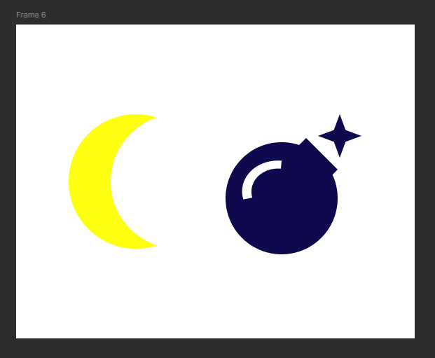

# Workshop_6

## Тема заняття
Булеві групи і флетен у figma

## Хід роботи

### 1. Підготовка робочого середовища
Для початку роботи, у Figma я створив фрейм.

### 2. Створення полумісяця
Створив фігуру полумісяця за допомогою двох кіл які розташував так, щоб при використанні Substract получилось отримати цю форму.

### 3. Створення бомби
Для іконки було створено Elipse та Ractangle, розташував їх відповідно щоб мали вигляд бомби та об'єднав їх за допомогою Union. Зірочку додав за допомогою інструмента Star, зменшив кількість проміней до 4. Блік було створено за допомогою Elipse з Arc і щоб він був прозорим використав Substract.

## Висновки
На практиці я зробив:
  - навчився використовувати булеві функції
  - навчився комбінувати фігури
  - створив дві фігури векторні

Ця робота навчила мене:
  - застосовувати Boolean Groups для створення іконок
  - використовувати флетен
  - будувати складні об’єкти за допомогою простих форм

