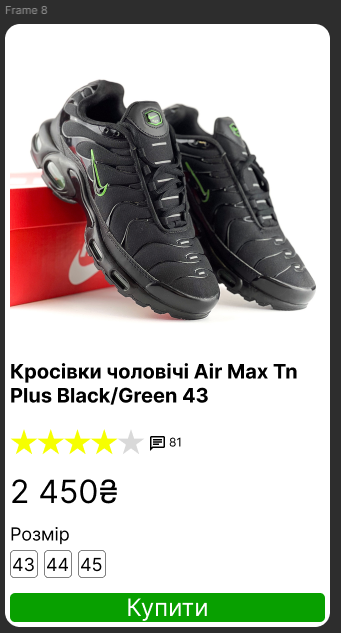

# Workshop_9

## Тема заняття
Функція Auto layout у Figma. Створення картки товару (послуги).

## Хід роботи

### 1. Підготовка робочого середовища
Для початку роботи, у Figma я створив фрейм на який буде в нас відповідати макетом картки товару.

### 2. Створення картки товару за допомогою Auto Layout
У головного фрейму заокруглив кути та застосував до нього Auto Layout з вертикальним напрямком. Взявши фото товару(кросівок) з [ROZETKA]([rozetka.com.ua](https://rozetka.com.ua/ua/promo/bfrrehearsal/?gad_source=1&gad_campaignid=22015516959&gbraid=0AAAAAq0EKAMMmU6Xn9OrXXMmediF8ErJb&gclid=CjwKCAiAuIDJBhBoEiwAxhgyFgqSqjJQK52X57lLFa3oykeDw6OS-dhKL1bTY_z0romyjohuaiD3ZBoCYBQQAvD_BwE)). 

Додав текст, а саме назву товару та ціну за товар. За допомогою фігури Star зробив 5 зірок, котрі в подальшому я об'єднав в один фрейм та додав на картку. Додав іконку повідомлень та їх кількість.

Створрив 3 додаткових фрейми, та додав в них текст який відповідав за різновідність розмірів.

На кынець додав кнопку "Купити".

Посилання на проект в Figma https://www.figma.com/design/bzDryDn3XPTbUYQr7FWRWe/%D0%9F%D1%80%D0%B0%D0%BA%D1%82%D0%B8%D1%87%D0%BD%D0%B0-4-9?node-id=19-2&p=f&t=pZIE6NsuDtIX4xGM-0

## Висновки
На практиці я зробив:
  - працював з інструментом Auto Layout
  - застосував вертикальні та горизонтальні Auto Layout блоки
  - працював з текстом, фотографією, іконками, фігурами

Ця робота навчила мене:
  - коректно організувати товарну картку, використовуючи Auto Layout
  - створювати адаптивні та легко змінювані інтерфейсні компоненти в Figma
  
